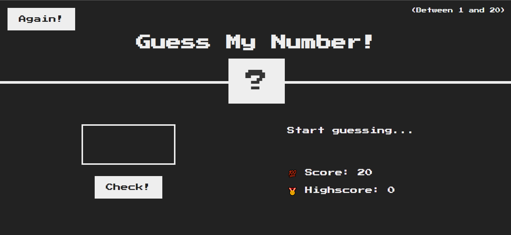

# Simple Guessing Game

## Table of Contents

- [Overview](#overview)
  - [Screenshot](#screenshot)
  - [Links](#links)
- [Build With](#built-with)
- [Author](#author)

## Overview

This is a simple Guessing game build with Vanila Javascipt.

### Screenshot

### Links

- Solution URL: [solution URL here](https://github.com/sagormajomder/frontend-mentor-respornsive-card-component)
- Live Site URL: [live site URL here](https://sagormajomder.github.io/JS-simple-Guessing-game/)

### Built with

- Semantic HTML5 markup
- CSS custom properties
- Flexbox
- Vanila JavaScript

## Author

- Facebook - [@sagormajomder](https://www.facebook.com/sagormajomder/)
- Twitter - [@sagormajomder](https://www.twitter.com/sagormajomder)
